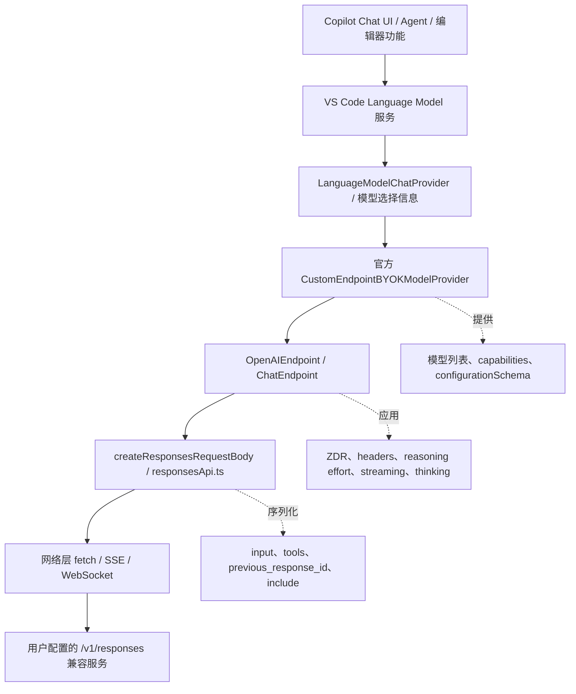
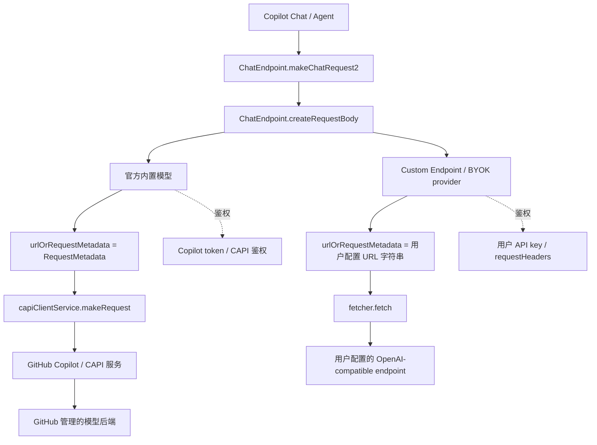
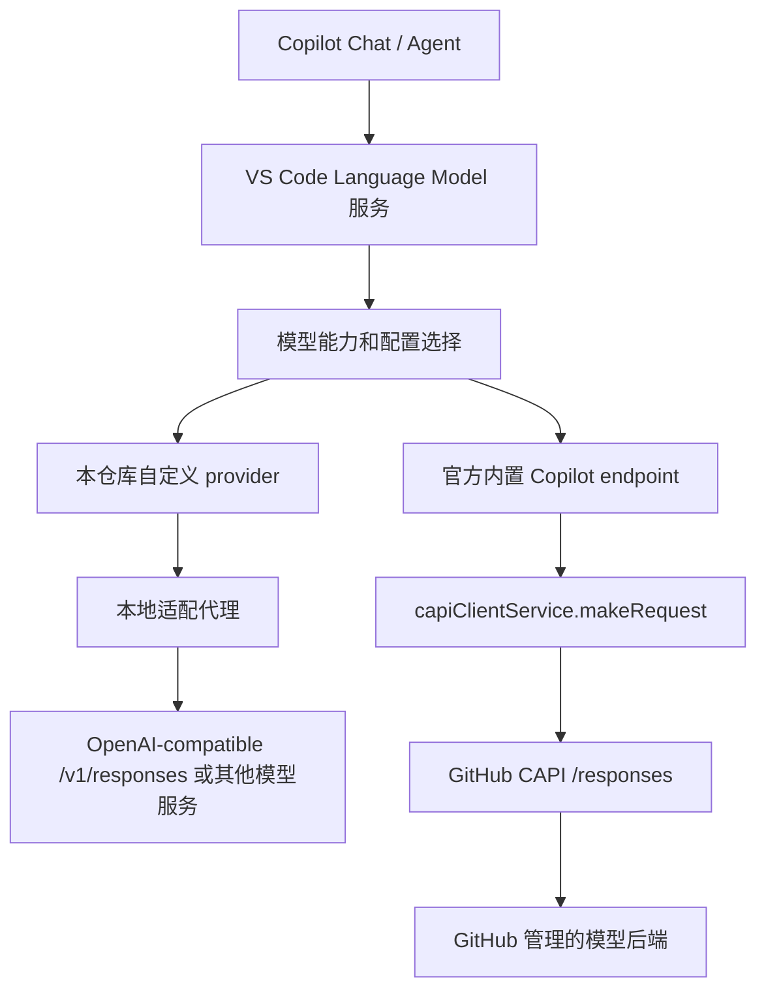

# Copilot Provider Responses API 交互流程

这份文档用于持续沉淀 VS Code/Copilot provider 行为的源码级结论。不要在这里加入无法从官方源码或官方 schema 追溯的实现细节。

核对日期：2026-05-27。

## 源码基线

- 版本断点：VS Code `1.121.0`，GitHub tag commit `987c959`。
- VS Code 源码：`microsoft/vscode` commit `b62d3739a7fee78ddb51c6da8ab0308adac43c63`。
- VS Code 使用的 Copilot API 客户端包：`@vscode/copilot-api@0.4.1`。
- OpenAI API schema：`openai/openai-openapi` commit `5162af98d3147432c14680df789e8e12d4891e6b`。

## 版本基线和断点

结论：本仓库从下一版开始选择 VS Code `1.121.0` 作为 Custom Endpoint/BYOK provider 行为基线，`1.121.0` 之前的 legacy `customOAI` / OpenAI Compatible provider 路线不再作为兼容目标。

依据：

- VS Code `1.120` release notes 仍描述的是既有 BYOK provider 的能力增强，例如 BYOK token usage、BYOK reasoning 模型的 Thinking Effort、model picker 按 provider 分组。它没有引入统一的 Custom Endpoint provider：https://code.visualstudio.com/updates/v1_120#_language-models
- VS Code `1.121` release notes 明确新增 Custom Endpoint provider，并写明它可以从一个配置接入 `chat-completions`、`responses`、`messages` 三类 endpoint：https://code.visualstudio.com/updates/v1_121#_custom-endpoint-provider-for-byok-insiders
- 同一段 release notes 还明确写明 Custom Endpoint provider 替代 legacy OpenAI Compatible (`customoai`) provider，后者只支持 Chat Completions，并已标记为 deprecation。
- GitHub tag `1.121.0` 指向 commit `987c9597516278c9fcf10d963a0592ce1384ab93`：https://github.com/microsoft/vscode/releases/tag/1.121.0
- VS Code `1.122` release notes 有 BYOK 后续修复和 UI 增强，例如 air-gapped BYOK、reasoning effort picker 默认值显示修复、Language Models editor provider group actions，但没有声明替代 Custom Endpoint provider 或新的 endpoint/config 契约断点：https://code.visualstudio.com/updates/v1_122

实现含义：

- 本扩展不再追求兼容 `customOAI` 旧配置形状。
- 兼容目标收敛为 `1.121.0` 之后的官方 Custom Endpoint/BYOK provider，重点复刻 Responses API 路径。
- `package.json` 的 `engines.vscode` 应不低于 `^1.121.0`。
- 如果后续 VS Code/Copilot 对 Custom Endpoint provider 再发生新的不兼容更新，再把本节的断点前移，并把旧断点归档为历史依据。

## 核心结论

官方 Custom Endpoint/BYOK provider 在 `apiType: "responses"` 路径下，最终调用的是标准 OpenAI Responses API 形状的 HTTP endpoint：

- 路由会解析到 `/responses` 或 `/v1/responses`。
- request body 由 `createResponsesRequestBody` 生成，字段包括 `model`、`input`、`previous_response_id`、`stream`、`tools`、`max_output_tokens`、`tool_choice`、`truncation`、`reasoning`、`include` 等 Responses API 字段。
- OpenAI 官方 OpenAPI schema 里有 `POST /responses`，并声明了这些字段。

但 provider 不是一个透明转发层。它夹在 VS Code/Copilot 的模型调用接口和 HTTP API 之间，负责把 Copilot 内部消息、工具、模型能力、状态标记和用户配置转换成 Responses API 请求。

## GitHub 托管后端和“标准 API”的边界

这里的“标准”需要分成两层看：

- 对 Custom Endpoint/BYOK provider：客户端最终直接请求用户配置的 URL 字符串。只要配置走 `apiType: "responses"`，URL 解析目标就是 `/responses` 或 `/v1/responses`，请求体也是 OpenAI Responses API 语义。
- 对 GitHub/Copilot 内置模型：VS Code 先把同一类 request body 交给 `capiClientService.makeRequest`，并携带 `RequestMetadata`，例如 `{ type: RequestType.ChatResponses }`。继续追到 `@vscode/copilot-api@0.4.1` 后，`ChatResponses` 会被发送到 GitHub CAPI 的 `/responses` 路径，默认 base URL 是 `https://api.githubcopilot.com`，或来自 Copilot token 的 `endpoints.api`。这说明 VS Code 客户端到 GitHub 的网络边界是 CAPI `/responses`，不是用户可直接替换的 OpenAI `/v1/responses` endpoint。

源码依据：

- `ChatEndpoint.urlOrRequestMetadata` 在 Responses 路径返回 `{ type: RequestType.ChatResponses }`，而不是 URL 字符串：https://github.com/microsoft/vscode/blob/b62d3739a7fee78ddb51c6da8ab0308adac43c63/extensions/copilot/src/platform/endpoint/node/chatEndpoint.ts#L292-L298
- `ChatEndpoint.createRequestBody` 在 Responses 路径仍然调用 `createResponsesRequestBody` 构造 Responses body： https://github.com/microsoft/vscode/blob/b62d3739a7fee78ddb51c6da8ab0308adac43c63/extensions/copilot/src/platform/endpoint/node/chatEndpoint.ts#L365-L368
- `networkRequest` 根据 `urlOrRequestMetadata` 的类型分叉：字符串走 `fetcher.fetch(url, request)`；非字符串走 `capiClientService.makeRequest(request, RequestMetadata)`：https://github.com/microsoft/vscode/blob/b62d3739a7fee78ddb51c6da8ab0308adac43c63/extensions/copilot/src/platform/networking/common/networking.ts#L505-L522
- BYOK `OpenAIEndpoint.urlOrRequestMetadata` 覆盖为用户配置的 `_modelUrl` 字符串，因此它和内置模型不同，会直接走 `fetcher.fetch`： https://github.com/microsoft/vscode/blob/b62d3739a7fee78ddb51c6da8ab0308adac43c63/extensions/copilot/src/extension/byok/node/openAIEndpoint.ts#L356-L358
- `@vscode/copilot-api@0.4.1` 的 `RequestType` 包含 `ChatResponses`，并且 `RequestMetadata` 允许 `{ type: RequestType.ChatResponses; isModelLab?: boolean }`。发布包 `dist/types.d.ts` 可核对 `RequestType.ChatResponses` 和 `RequestMetadata`。
- `@vscode/copilot-api@0.4.1` 的 `CAPIClient.makeRequest` 在 `ChatResponses` 分支调用 `fetch(capiResponsesURL, request)`；`capiResponsesURL` 是 `${capiBaseURL}/responses`，`capiBaseURL` 默认是 `https://api.githubcopilot.com`，也可由 Copilot token 的 `endpoints.api` 覆盖。发布包 `dist/index.js` 已压缩成单行，可搜索 `capiResponsesURL` 和 `case"ChatResponses"` 核对。

结论：从公开客户端侧源码能确定的是，内置模型使用 Responses API 语义的 body，并通过 `@vscode/copilot-api` 发到 GitHub CAPI `/responses`；Custom Endpoint/BYOK 才是客户端直接访问用户配置的 OpenAI-compatible `/v1/responses` endpoint。GitHub CAPI 服务端收到 `/responses` 后如何路由到模型后端、是否继续调用某个厂商的标准 OpenAI Responses API，不在 VS Code 客户端源码和 `@vscode/copilot-api` 客户端包中，不能写成确定结论。

## `ChatResponses` body 能否直发标准 `/v1/responses`

结论：`createResponsesRequestBody` 生成的 body 是标准 OpenAI Responses API 语义，可以作为直发标准 `/v1/responses` endpoint 的请求体基础；但不能把 `capiClientService.makeRequest` 的整个 request 原样发给标准 endpoint。官方 BYOK/OpenAI-compatible 路径本身也会在发送前做兼容处理。

官方 BYOK 路径证明了这一点：

- `ChatEndpoint.createRequestBody` 在 Responses 路径调用 `createResponsesRequestBody`。
- BYOK `OpenAIEndpoint.createRequestBody` 复用这个 body，然后执行 Responses 兼容处理。
- BYOK `OpenAIEndpoint.urlOrRequestMetadata` 返回用户配置 URL 字符串。
- `networkRequest` 在 endpoint 目标是字符串时走 `fetcher.fetch(url, request)`，也就是直接请求用户配置的 OpenAI-compatible endpoint。

源码依据：

- `createResponsesRequestBody` 构造 `model`、`input`、`stream`、`tools`、`max_output_tokens`、`tool_choice`、`top_logprobs`、`store`、`text`、`context_management`、`truncation`、`reasoning`、`include`、`prompt_cache_key`：https://github.com/microsoft/vscode/blob/b62d3739a7fee78ddb51c6da8ab0308adac43c63/extensions/copilot/src/platform/endpoint/node/responsesApi.ts#L127-L180
- BYOK `OpenAIEndpoint.createRequestBody` 在 Responses 路径设置 `store = !zdr`，删除 `n`、`stream_options`，非 thinking 模型删除 `reasoning`/`include`，并且只在 `previous_response_id` 以 `resp_` 开头且非 ZDR 时保留： https://github.com/microsoft/vscode/blob/b62d3739a7fee78ddb51c6da8ab0308adac43c63/extensions/copilot/src/extension/byok/node/openAIEndpoint.ts#L248-L268
- BYOK `OpenAIEndpoint.interceptBody` 会删除空 `tools`，补齐 function tool 的 `parameters`，thinking 模型删除 `temperature`，非 Messages 路径删除 `max_tokens`： https://github.com/microsoft/vscode/blob/b62d3739a7fee78ddb51c6da8ab0308adac43c63/extensions/copilot/src/extension/byok/node/openAIEndpoint.ts#L319-L353
- OpenAI 官方 schema 声明 `POST /responses`：https://github.com/openai/openai-openapi/blob/5162af98d3147432c14680df789e8e12d4891e6b/openapi.yaml#L25823-L25849
- OpenAI 官方 schema 的 Create Response params 包含 `input`、`previous_response_id`、`tools`、`text`、`reasoning`、`truncation`、`tool_choice`、`parallel_tool_calls` 等字段： https://github.com/openai/openai-openapi/blob/5162af98d3147432c14680df789e8e12d4891e6b/openapi.yaml#L78680-L78760
- OpenAI 官方 schema 的 `include` 支持 `reasoning.encrypted_content`：https://github.com/openai/openai-openapi/blob/5162af98d3147432c14680df789e8e12d4891e6b/openapi.yaml#L75285-L75324

因此，对自定义 provider 来说正确做法是：

- 复用 `createResponsesRequestBody` 的字段映射思路。
- 按 BYOK 逻辑清理 CAPI/Chat Completions 残留字段，例如 `n`、`stream_options`、`max_tokens`。
- 按模型能力裁剪 `tools`、`reasoning`、`include`、`temperature`。
- 只在确认 stateful marker 是标准 Responses 返回的 `resp_...` 且非 ZDR 时发送 `previous_response_id`。
- 请求 headers 不能沿用 CAPI headers 和 Copilot token；标准 endpoint 应使用该 endpoint 的 `Content-Type`、`Authorization`/`api-key` 或用户配置的 `requestHeaders`。

本仓库目标：构造标准 Responses body，并在发送前应用与官方 BYOK 等价的兼容处理，而不是把 CAPI request 原样转发到用户 endpoint。

## Provider 所在层级



对本扩展来说，我们实现的是公开的 `LanguageModelChatProvider` 这一层。因此扩展收到的是 VS Code/Copilot 发来的 provider 请求，需要自己完成官方 `OpenAIEndpoint + responsesApi.ts` 那一段适配工作。

## 官方内置模型请求链路 vs Provider 请求链路

“官方内置模型”和“Custom Endpoint/BYOK provider”在 Copilot 上层调用入口相同，都会经过 `ChatEndpoint` 的请求构造和响应处理逻辑；关键差异在 `endpoint.urlOrRequestMetadata`、鉴权、模型 metadata 来源、以及是否直接请求用户 URL。



源码依据：

- `ChatEndpoint.urlOrRequestMetadata` 默认返回 `RequestMetadata`，根据 endpoint 能力选择 `ChatResponses`、`ChatMessages` 或 `ChatCompletions`：https://github.com/microsoft/vscode/blob/b62d3739a7fee78ddb51c6da8ab0308adac43c63/extensions/copilot/src/platform/endpoint/node/chatEndpoint.ts#L292-L298
- `ChatEndpoint.createRequestBody` 根据 `useResponsesApi` / `useMessagesApi` / 默认 Chat Completions 路径选择 body 构造函数： https://github.com/microsoft/vscode/blob/b62d3739a7fee78ddb51c6da8ab0308adac43c63/extensions/copilot/src/platform/endpoint/node/chatEndpoint.ts#L358-L374
- `networkRequest` 在 `urlOrRequestMetadata` 是字符串时走 `fetcher.fetch(url, request)`；不是字符串时走 `capiClientService.makeRequest(request, RequestMetadata)`：https://github.com/microsoft/vscode/blob/b62d3739a7fee78ddb51c6da8ab0308adac43c63/extensions/copilot/src/platform/networking/common/networking.ts#L505-L522
- `networkRequest` 会默认把 `secretKey` 写成 `Authorization: Bearer <secretKey>`，并合并 endpoint 的 extra headers： https://github.com/microsoft/vscode/blob/b62d3739a7fee78ddb51c6da8ab0308adac43c63/extensions/copilot/src/platform/networking/common/networking.ts#L467-L474
- BYOK `OpenAIEndpoint` 声明 `ownsAuthorization = true`，表示 endpoint 自己持有鉴权，fetcher 不应回退使用 CAPI Copilot bearer token： https://github.com/microsoft/vscode/blob/b62d3739a7fee78ddb51c6da8ab0308adac43c63/extensions/copilot/src/extension/byok/node/openAIEndpoint.ts#L141-L146
- BYOK `OpenAIEndpoint.urlOrRequestMetadata` 覆盖为用户配置的 `_modelUrl` 字符串： https://github.com/microsoft/vscode/blob/b62d3739a7fee78ddb51c6da8ab0308adac43c63/extensions/copilot/src/extension/byok/node/openAIEndpoint.ts#L356-L358
- BYOK `OpenAIEndpoint.getExtraHeaders` 使用用户 API key，Azure URL 用 `api-key`，其他 URL 用 `Authorization: Bearer`： https://github.com/microsoft/vscode/blob/b62d3739a7fee78ddb51c6da8ab0308adac43c63/extensions/copilot/src/extension/byok/node/openAIEndpoint.ts#L360-L373
- Custom Endpoint provider 会把用户配置的 model URL resolve 成最终 URL，并创建 `CustomEndpointOAIEndpoint`： https://github.com/microsoft/vscode/blob/b62d3739a7fee78ddb51c6da8ab0308adac43c63/extensions/copilot/src/extension/byok/vscode-node/customEndpointProvider.ts#L147-L172

具体差异：

- 内置模型的 endpoint 目标通常是 `RequestMetadata`，由 `capiClientService` 发送到 GitHub Copilot/CAPI 侧；provider/BYOK 的 endpoint 目标是用户配置的 URL 字符串，由通用 fetcher 直接请求。
- 内置模型鉴权使用 Copilot/CAPI 鉴权；BYOK provider 鉴权使用用户配置 API key，并显式声明自己 owns authorization，避免把 Copilot bearer token 发到第三方 endpoint。
- 内置模型 metadata 来自 GitHub/Copilot 的模型服务，包含 billing、SKU、premium、实验、内部 feature gate 等；Custom Endpoint/BYOK 的 metadata 由用户配置的 model capabilities 解析出来。
- Responses request body 构造函数可以相同，都是 `createResponsesRequestBody`，但 BYOK 的 `OpenAIEndpoint.createRequestBody` 会额外处理 ZDR、`n`、`stream_options`、`previous_response_id`、thinking、reasoning effort 等兼容逻辑。
- 内置模型可以依赖 CAPI 内部策略、遥测、content filter、prompt cache key、实验开关和 server-side 能力；provider/BYOK 只能使用公开配置和用户 endpoint 支持的能力。

## Responses 路由选择

VS Code 内置 Custom Endpoint provider 明确支持三种 API 类型：

```text
chat-completions | responses | messages
```

源码依据：

- `CustomEndpointApiType` 包含 `responses`：https://github.com/microsoft/vscode/blob/b62d3739a7fee78ddb51c6da8ab0308adac43c63/extensions/copilot/src/extension/byok/vscode-node/customEndpointProvider.ts#L22
- `apiTypeToPath('responses')` 映射到 `/responses`：https://github.com/microsoft/vscode/blob/b62d3739a7fee78ddb51c6da8ab0308adac43c63/extensions/copilot/src/extension/byok/vscode-node/customEndpointProvider.ts#L47-L54
- `resolveCustomEndpointUrl` 只有在 URL 已经包含显式 API 路径时才原样使用；否则会移除末尾一个 `/`，对 `/v1` 这类版本根路径追加 `/responses`，其他情况追加 `/v1/responses`：https://github.com/microsoft/vscode/blob/b62d3739a7fee78ddb51c6da8ab0308adac43c63/extensions/copilot/src/extension/byok/vscode-node/customEndpointProvider.ts#L24-L45
- 显式 API 路径检测包含 `/responses`、`/chat/completions`、`/messages`：https://github.com/microsoft/vscode/blob/b62d3739a7fee78ddb51c6da8ab0308adac43c63/extensions/copilot/src/extension/byok/vscode-node/customEndpointProvider.ts#L57-L59
- `apiType: "responses"` 会把模型 metadata 标记为支持 Responses：https://github.com/microsoft/vscode/blob/b62d3739a7fee78ddb51c6da8ab0308adac43c63/extensions/copilot/src/extension/byok/vscode-node/customEndpointProvider.ts#L71-L80
- `ChatEndpoint.useResponsesApi` 会在模型 metadata 包含 `ModelSupportedEndpoint.Responses` 时走 Responses 路径：https://github.com/microsoft/vscode/blob/b62d3739a7fee78ddb51c6da8ab0308adac43c63/extensions/copilot/src/platform/endpoint/node/chatEndpoint.ts#L300-L309

结论：内置 provider 的 `responses` 路径确实是面向 Responses 风格 endpoint，不是把 Chat Completions endpoint 换名叫 responses。

## BYOK 模型能力

内置 BYOK capability 对象中，和 Responses 路径相关的字段包括：`maxInputTokens`、`maxOutputTokens`、`toolCalling`、`vision`、`thinking`、`adaptiveThinking`、`streaming`、`editTools`、`requestHeaders`、`supportedEndpoints`、`zeroDataRetentionEnabled`、`supportsReasoningEffort`、`reasoningEffortFormat`。

源码依据：

- `BYOKModelCapabilities` 声明： https://github.com/microsoft/vscode/blob/b62d3739a7fee78ddb51c6da8ab0308adac43c63/extensions/copilot/src/extension/byok/common/byokProvider.ts#L47-L68
- capability 映射到 Copilot model metadata，包括 `streaming`、`tool_calls`、`vision`、`thinking`、`reasoning_effort`、`supported_endpoints`、`zeroDataRetentionEnabled`、`reasoningEffortFormat`、`requestHeaders`：https://github.com/microsoft/vscode/blob/b62d3739a7fee78ddb51c6da8ab0308adac43c63/extensions/copilot/src/extension/byok/common/byokProvider.ts#L95-L136
- 公开 `LanguageModelChatInformation.capabilities` 接收 `toolCalling`、`imageInput`、`editTools`：https://github.com/microsoft/vscode/blob/b62d3739a7fee78ddb51c6da8ab0308adac43c63/extensions/copilot/src/extension/byok/common/byokProvider.ts#L146-L167
- Custom Endpoint model config 声明 `thinking`、`streaming`、`editTools`、`requestHeaders`、`zeroDataRetentionEnabled`、`supportsReasoningEffort`、`reasoningEffortFormat`：https://github.com/microsoft/vscode/blob/b62d3739a7fee78ddb51c6da8ab0308adac43c63/extensions/copilot/src/extension/byok/vscode-node/customEndpointProvider.ts#L89-L104
- `ModelSupportedEndpoint` 包含 `/responses` 和 `ws:/responses`：https://github.com/microsoft/vscode/blob/b62d3739a7fee78ddb51c6da8ab0308adac43c63/extensions/copilot/src/platform/endpoint/common/endpointProvider.ts#L75-L80

本仓库目标：在 `profiles[].models[]` 暴露同样的 Responses 相关字段，并在公开 VS Code language model provider API 允许的范围内映射到模型能力。

## 兼容字段影响

和官方 Custom Endpoint model config 相比，对兼容性有影响的字段如下：

- `url`：官方 Custom Endpoint model 使用 `url`；本仓库用 `baseUrl` 承担同样的 Responses 请求 URL 角色。只要配置了 `baseUrl`，Responses 能力不受影响，差异主要是配置字段名。
- `apiType`：官方 Custom Endpoint 支持 `chat-completions`、`responses`、`messages`；本仓库目前不暴露 `apiType`，固定面向 Responses-compatible 服务。影响：不能用一套 provider 配置同时路由 Chat Completions 或 Messages。
- `adaptiveThinking`：官方通用 `BYOKModelCapabilities` 有这个字段，但官方 Custom Endpoint model config 没暴露它。对本仓库当前 Responses 目标影响不明显；官方代码主要在 Messages/Anthropic beta header 路径使用它。
- `tool_search`：官方 endpoint capability 可由内部逻辑推断，并驱动 Responses client-executed tool search。它不是 Custom Endpoint model config 字段，也不能从公开 provider API 获得。影响：大量工具场景下，本仓库无法等价实现内置 Copilot 的工具延迟加载/搜索。
- `context_editing`、`prediction`、`min_thinking_budget`、`max_thinking_budget`：这些是 `ChatEndpoint` 读取的内部 endpoint capability，不是官方 Custom Endpoint model config 字段。影响：本仓库不会触发这些内部 feature gate。

## Headers 和鉴权

内置 Custom Endpoint subclass 支持 model-level `requestHeaders`，并允许用户为网关、APIM、自定义域名等场景覆盖鉴权头。

源码依据：

- `requestHeaders` 从 Custom Endpoint model config 传入 model capabilities： https://github.com/microsoft/vscode/blob/b62d3739a7fee78ddb51c6da8ab0308adac43c63/extensions/copilot/src/extension/byok/vscode-node/customEndpointProvider.ts#L147-L165
- 基类 `OpenAIEndpoint` 会 sanitize custom headers，包括 20 个 header 数量限制、header 名格式校验、保留 header 阻断、`proxy-`/`sec-` 模式阻断、method override 阻断，以及控制字符/零宽字符 value 阻断： https://github.com/microsoft/vscode/blob/b62d3739a7fee78ddb51c6da8ab0308adac43c63/extensions/copilot/src/extension/byok/node/openAIEndpoint.ts#L56-L246
- Custom Endpoint subclass 只在该 subclass 中允许 `api-key` 和 `authorization` 穿过保留 header 检查： https://github.com/microsoft/vscode/blob/b62d3739a7fee78ddb51c6da8ab0308adac43c63/extensions/copilot/src/extension/byok/vscode-node/customEndpointProvider.ts#L195-L249
- 如果用户 `requestHeaders` 含 `api-key`、`authorization`、`x-api-key`、`x-goog-api-key` 或 `apikey`，默认鉴权头会被抑制： https://github.com/microsoft/vscode/blob/b62d3739a7fee78ddb51c6da8ab0308adac43c63/extensions/copilot/src/extension/byok/vscode-node/customEndpointProvider.ts#L208-L222
- Custom Endpoint 默认鉴权：URL 包含 `openai.azure` 时使用 `api-key`，否则使用 `Authorization: Bearer`；custom header value 中的 `${apiKey}` 会被替换成配置的 API key： https://github.com/microsoft/vscode/blob/b62d3739a7fee78ddb51c6da8ab0308adac43c63/extensions/copilot/src/extension/byok/vscode-node/customEndpointProvider.ts#L251-L292

本仓库目标：profile `extraHeaders` 保持为非鉴权静态 header；model `requestHeaders` 实现同样的鉴权覆盖、默认鉴权抑制、header sanitizer 和 `${apiKey}` 插值语义。

## Responses Request Body

内置 OpenAI-compatible endpoint 在 `useResponsesApi` 为 true 时，会通过 `ChatEndpoint.createRequestBody` 委托到 Responses request body 构造。

源码依据：

- `ChatEndpoint.createRequestBody` 在 Responses 路径调用 `createResponsesRequestBody`：https://github.com/microsoft/vscode/blob/b62d3739a7fee78ddb51c6da8ab0308adac43c63/extensions/copilot/src/platform/endpoint/node/chatEndpoint.ts#L365-L368
- `createResponsesRequestBody` 构造包含 `model`、`input`、`previous_response_id`、`stream`、`tools`、`max_output_tokens`、`tool_choice`、`top_logprobs`、`store`、`context_management`、`truncation`、`reasoning`、`include` 的 body： https://github.com/microsoft/vscode/blob/b62d3739a7fee78ddb51c6da8ab0308adac43c63/extensions/copilot/src/platform/endpoint/node/responsesApi.ts#L48-L175
- `OpenAIEndpoint.createRequestBody` 在 BYOK Responses 路径继续定制 body：`store` 跟随 zero-data-retention，删除 `n` 和 `stream_options`，非 Responses id 不复用为 `previous_response_id`，最后应用 reasoning effort： https://github.com/microsoft/vscode/blob/b62d3739a7fee78ddb51c6da8ab0308adac43c63/extensions/copilot/src/extension/byok/node/openAIEndpoint.ts#L248-L268
- `ChatEndpoint.interceptBody` 在模型不支持 tool calls 时移除 tools，在不支持 streaming 时设置 `stream: false`：https://github.com/microsoft/vscode/blob/b62d3739a7fee78ddb51c6da8ab0308adac43c63/extensions/copilot/src/platform/endpoint/node/chatEndpoint.ts#L329-L339
- `OpenAIEndpoint.interceptBody` 对 thinking 模型移除 `temperature`，并在非 Messages API 路径移除 `max_tokens`：https://github.com/microsoft/vscode/blob/b62d3739a7fee78ddb51c6da8ab0308adac43c63/extensions/copilot/src/extension/byok/node/openAIEndpoint.ts#L319-L353
- Responses text verbosity 来自 `getVerbosityForModelSync`，当前 `gpt-5.1` 和 `gpt-5-mini` 为 `low`：https://github.com/microsoft/vscode/blob/b62d3739a7fee78ddb51c6da8ab0308adac43c63/extensions/copilot/src/platform/endpoint/common/chatModelCapabilities.ts#L426-L435
- Responses context management 对 `gpt-5`、`gpt-5.1`、`gpt-5.2` 禁用：https://github.com/microsoft/vscode/blob/b62d3739a7fee78ddb51c6da8ab0308adac43c63/extensions/copilot/src/platform/networking/common/openai.ts#L97-L100

OpenAI 官方 schema 依据：

- OpenAI OpenAPI schema 存在 `POST /responses`：https://github.com/openai/openai-openapi/blob/5162af98d3147432c14680df789e8e12d4891e6b/openapi.yaml#L25823-L25825
- Response object 包含 `previous_response_id`、`reasoning`、`tool_choice`、`tools`、`top_p`、`truncation`、`usage` 等字段：https://github.com/openai/openai-openapi/blob/5162af98d3147432c14680df789e8e12d4891e6b/openapi.yaml#L66538-L66570
- Create params 包含 `previous_response_id`、`reasoning`、`tools`、`tool_choice`、`truncation`：https://github.com/openai/openai-openapi/blob/5162af98d3147432c14680df789e8e12d4891e6b/openapi.yaml#L78691-L78750
- `include` 支持 `reasoning.encrypted_content`，用于加密 reasoning round-trip： https://github.com/openai/openai-openapi/blob/5162af98d3147432c14680df789e8e12d4891e6b/openapi.yaml#L75291-L75321

结论：VS Code Responses 路径使用的是标准 OpenAI Responses API 概念和字段。provider 仍然会在标准 API 之上叠加状态复用、ZDR、reasoning metadata、tool search 等策略。

## Stateful 和 WebSocket 流程

VS Code Responses 路径可以复用 `previous_response_id`，并在启用时有单独的 WebSocket Responses 处理。

源码依据：

- HTTP stateful marker reuse 会查找最近的 stateful marker，并从 marker 之后裁剪历史；WebSocket 路径可使用连接上的 marker： https://github.com/microsoft/vscode/blob/b62d3739a7fee78ddb51c6da8ab0308adac43c63/extensions/copilot/src/platform/endpoint/node/responsesApi.ts#L285-L327
- 历史被裁剪时，必要情况下仍保留最新 compaction item： https://github.com/microsoft/vscode/blob/b62d3739a7fee78ddb51c6da8ab0308adac43c63/extensions/copilot/src/platform/endpoint/node/responsesApi.ts#L360-L374
- `makeChatRequest2` 只有在存在 turn/conversation ids、模型支持 `ws:/responses`、内部实验开启时才启用 WebSocket Responses；如果 stateful marker 无效，会禁用 marker reuse 后重试： https://github.com/microsoft/vscode/blob/b62d3739a7fee78ddb51c6da8ab0308adac43c63/extensions/copilot/src/platform/endpoint/node/chatEndpoint.ts#L455-L480

本仓库目标：通过公开 `LanguageModelDataPart` 支持 HTTP stateful marker reuse；ZDR 时抑制 stateful marker；支持显式 `ws:/responses` opt-in。内部 experiment gate 和 Copilot conversation id 不属于公开 provider API。

## Thinking Effort 选择器

内置 BYOK model picker 通过 `LanguageModelChatInformation.configurationSchema` 暴露 Thinking Effort。

源码依据：

- BYOK model config 声明 `supportsReasoningEffort?: string[]`：https://github.com/microsoft/vscode/blob/b62d3739a7fee78ddb51c6da8ab0308adac43c63/extensions/copilot/src/extension/byok/vscode-node/customEndpointProvider.ts#L89-L104
- `byokKnownModelToAPIInfoWithEffort` 在 `supportsReasoningEffort` 存在时添加 `configurationSchema.properties.reasoningEffort`： https://github.com/microsoft/vscode/blob/b62d3739a7fee78ddb51c6da8ab0308adac43c63/extensions/copilot/src/extension/byok/vscode-node/byokModelInfo.ts#L14-L27
- schema property 的 title 是 `Thinking Effort`，包含 enum label/description，`group` 为 `navigation`，并按可用 levels 选择默认值： https://github.com/microsoft/vscode/blob/b62d3739a7fee78ddb51c6da8ab0308adac43c63/extensions/copilot/src/extension/conversation/common/languageModelAccess.ts#L21-L55
- `OpenAIEndpoint._applyReasoningEffort` 从 model capabilities 读取每次请求的 selected value，并按 Responses API 写入 nested `reasoning.effort`，或按 Chat Completions 写入 top-level `reasoning_effort`；`reasoningEffortFormat` 可覆盖 body shape： https://github.com/microsoft/vscode/blob/b62d3739a7fee78ddb51c6da8ab0308adac43c63/extensions/copilot/src/extension/byok/node/openAIEndpoint.ts#L286-L317
- proposed `chatProvider` API 声明了 `LanguageModelChatInformation.configurationSchema` 和 `ProvideLanguageModelChatResponseOptions.modelConfiguration`： https://github.com/microsoft/vscode/blob/b62d3739a7fee78ddb51c6da8ab0308adac43c63/src/vscode-dts/vscode.proposed.chatProvider.d.ts#L13-L70

结论：自定义 provider 在启用 proposed `chatProvider` API 时可以实现同样的 Thinking Effort picker 路径。本扩展在配置 `supportsReasoningEffort` 时贡献 `configurationSchema.properties.reasoningEffort`，并把 `options.modelConfiguration.reasoningEffort` 写入 `reasoning.effort`。

## Tool Search

内置 Responses 路径对 client-executed `tool_search` 协议有特殊处理。

源码依据：

- Responses body builder 保留 `tool_search` function-tool 名，不把它当普通 function tool 发送，并可添加 `{ type: 'tool_search', execution: 'client' }`：https://github.com/microsoft/vscode/blob/b62d3739a7fee78ddb51c6da8ab0308adac43c63/extensions/copilot/src/platform/endpoint/node/responsesApi.ts#L62-L125
- conversation history conversion 会 round-trip `tool_search_call` 和 `tool_search_output` items，并可从 `IToolDeferralService` 加载 deferred tool definitions： https://github.com/microsoft/vscode/blob/b62d3739a7fee78ddb51c6da8ab0308adac43c63/extensions/copilot/src/platform/endpoint/node/responsesApi.ts#L334-L455
- tool search output 会用 `defer_loading: true` 重建 deferred function tool definitions： https://github.com/microsoft/vscode/blob/b62d3739a7fee78ddb51c6da8ab0308adac43c63/extensions/copilot/src/platform/endpoint/node/responsesApi.ts#L470-L492

本仓库当前状态：`tool_search` 被视为保留 tool name，不作为普通 function tool 转发。完整 client-executed tool search 尚未实现，因为公开 extension provider API 不暴露 Copilot 内部 `IToolDeferralService`。

## 当前扩展映射

当前本仓库实现的映射：

- `profiles[].models[].supportsReasoningEffort` 声明可接受 levels，并启用 picker schema；这个 settings 数组就是 Copilot Thinking Effort UI 的枚举来源。本扩展额外提供配置便利规则：省略该属性表示不启用 picker；显式配置 `[]` 会展开为默认五档 `minimal`、`low`、`medium`、`high`、`xhigh`；非空数组按配置原样作为 picker enum。
- `profiles[].models[].reasoningEffort` 作为 model fallback effort。0.8.0 起不再限制为固定五档字符串；只要 endpoint 接受，并且值在 `supportsReasoningEffort` 中，就可以显示在 UI 并写入请求体。
- 请求优先级：`options.modelConfiguration.reasoningEffort` -> `options.modelOptions.reasoningEffort` -> `options.modelOptions.reasoning.effort` -> `options.modelOptions.reasoning_effort` -> model `reasoningEffort`。
- 当存在 `supportsReasoningEffort` 且没有 request value 时，默认值按 `model.reasoningEffort` -> `defaultReasoningEffort` -> family preferred default -> first advertised level 选择，且必须在 advertised supported levels 中。
- 当不存在 `supportsReasoningEffort` 时，只发送显式 request/model `reasoningEffort`；全局 `defaultReasoningEffort` 不注入 request body。
- Responses 请求默认按以下形状发送 resolved effort：

```json
{
  "reasoning": {
    "effort": "<selected level>"
  }
}
```

- 如果 `reasoningEffortFormat` 为 `chat-completions`，provider 写入 top-level `reasoning_effort`。
- `thinking: true` 控制 `include: ["reasoning.encrypted_content"]`、encrypted reasoning round-trip 和 temperature removal。
- `streaming: false` 强制 `stream: false`。
- `editTools` 作为 public language model capability hint 暴露。
- model `requestHeaders` 可以覆盖 auth，并支持 `${apiKey}` 插值。

## 已知缺口

- 完整 client-executed `tool_search` deferral 尚未实现，因为公开 provider API 不暴露 Copilot 内部 `IToolDeferralService`。
- `prompt_cache_key` 生成依赖内部 `conversationId` 和 experiment state；本仓库目前不能通过公开 provider request 拿到同等数据。
- VS Code 内置路径包含内部 telemetry 和 content-filter 处理，本仓库没有完整复刻。
- 内置 provider 在一个 Custom Endpoint provider 中支持 Chat Completions、Responses、Messages。本扩展当前只面向 Responses-compatible 服务。

## 代理程序方案边界

这里需要区分两类“代理”：

1. **Custom Endpoint/BYOK 后面的本地适配代理**：VS Code provider 的 `url`/`baseUrl` 指向 `http://127.0.0.1:<port>/v1/responses`，本地代理再转发到真实模型服务。
2. **拦截官方内置 Copilot/CAPI 网络流量的透明代理**：让官方内置模型请求先经过本地代理，再改写或转发。

两者不是同一层。



### Custom Endpoint 后置代理：可行且推荐

这种方案把本扩展保留为“能力声明 + VS Code provider 接入层”，把复杂的协议转换、日志、网关鉴权、模型路由放到一个独立本地服务里。

源码依据：

- Custom Endpoint/BYOK 的 endpoint 目标是 URL 字符串，`networkRequest` 会走 `fetcher.fetch(endpoint.urlOrRequestMetadata, request)`：https://github.com/microsoft/vscode/blob/b62d3739a7fee78ddb51c6da8ab0308adac43c63/extensions/copilot/src/platform/networking/common/networking.ts#L505-L519
- BYOK `OpenAIEndpoint.urlOrRequestMetadata` 返回用户配置的 `_modelUrl`：https://github.com/microsoft/vscode/blob/b62d3739a7fee78ddb51c6da8ab0308adac43c63/extensions/copilot/src/extension/byok/node/openAIEndpoint.ts#L356-L358
- Custom Endpoint 会把配置的 URL resolve 成最终 API URL，并创建 `CustomEndpointOAIEndpoint`：https://github.com/microsoft/vscode/blob/b62d3739a7fee78ddb51c6da8ab0308adac43c63/extensions/copilot/src/extension/byok/vscode-node/customEndpointProvider.ts#L147-L172
- Responses body 在 provider 侧已经是 Responses API 语义；BYOK 发送前还会清理 `store`、`n`、`stream_options`、`previous_response_id`、`reasoning`、`include`：https://github.com/microsoft/vscode/blob/b62d3739a7fee78ddb51c6da8ab0308adac43c63/extensions/copilot/src/extension/byok/node/openAIEndpoint.ts#L248-L268

适合放进代理程序的工作：

- OpenAI Responses API 到其他模型 API 的 body 转换。
- SSE/非流式响应格式转换。
- 网关鉴权、header 改写、模型 ID 映射。
- 请求/响应日志和回放。
- 不同供应商的兼容性补丁。

仍然必须留在 provider/扩展里的工作：

- 模型列表、模型 ID、名称、最大 token、vision、toolCalling、editTools、thinking、streaming 等能力声明。
- `configurationSchema`，包括 Thinking Effort 选择器。
- VS Code public `LanguageModelChatProvider` 的注册、选择、取消、响应 part 输出。
- 公开 API 能拿到的 stateful marker、encrypted reasoning round-trip 等请求上下文整理。

原因：这些能力在 HTTP 请求发出之前就会影响 Copilot/VS Code 的 UI、模型选择和请求构造；后置代理看不到或无法改变已经完成的 UI/能力决策。

结论：如果目标是“只改模型 API 兼容和转发逻辑”，本地代理是更清晰的架构；如果目标是“让模型在 Copilot UI 中表现出完整能力”，provider 仍然不能省。

### 拦截官方内置 Copilot/CAPI 流量：不建议作为主线

从客户端源码只能确定官方内置模型的请求会经过 `capiClientService.makeRequest(request, { type: ChatResponses })`，再由 `@vscode/copilot-api` 发到 GitHub CAPI `/responses`。这不是官方公开的 provider 扩展点。

源码依据：

- 内置 Responses endpoint 默认返回 `{ type: RequestType.ChatResponses }`，而不是用户 URL：https://github.com/microsoft/vscode/blob/b62d3739a7fee78ddb51c6da8ab0308adac43c63/extensions/copilot/src/platform/endpoint/node/chatEndpoint.ts#L292-L298
- `networkRequest` 对非 URL 的 `RequestMetadata` 走 `capiClientService.makeRequest`：https://github.com/microsoft/vscode/blob/b62d3739a7fee78ddb51c6da8ab0308adac43c63/extensions/copilot/src/platform/networking/common/networking.ts#L520-L522
- `@vscode/copilot-api@0.4.1` 的 `ChatResponses` 分支请求 `${capiBaseURL}/responses`；`capiBaseURL` 默认是 `https://api.githubcopilot.com`，也可来自 Copilot token 的 `endpoints.api`。发布包 `dist/index.js` 可搜索 `case"ChatResponses"`、`capiResponsesURL` 和 `_getCAPIUrl` 核对。

这种透明代理能做的事情有限：

- 可以观察或改写已经形成的 HTTP 请求和响应。
- 可以用于调试网络层、记录 body、验证某些字段。

但它不适合作为“能力一模一样”的主线：

- 不能可靠改变 VS Code 模型选择 UI、Thinking Effort picker、toolCalling、vision、editTools 等请求前能力声明。
- 不知道 GitHub CAPI 服务端对 `/responses` 的完整私有契约；客户端源码没有公开 CAPI 后续如何路由。
- 若要替换内置模型结果，还必须兼容 GitHub CAPI 的鉴权、模型列表、策略、响应流、错误格式和其他相关 endpoint，范围会超过“只代理 chat 请求”。
- 这种拦截不是官方 BYOK/Custom Endpoint 路径，升级 VS Code 或 Copilot 客户端后更容易失效。

结论：不要把“拦截官方内置 Copilot 请求”作为能力复刻主线。更稳的路线是：本扩展继续复刻官方 Custom Endpoint/BYOK provider 的能力声明和 request 构造；复杂的供应商适配下沉到一个本地代理程序。

### 直接控制内置 CAPI 目标地址

如果目标明确是“不写 provider，直接让官方内置 Copilot 的 CAPI 请求打到本地代理”，源码里存在一个直接控制点：`github.copilot.advanced.debug.overrideCapiUrl`。

这不是 `HTTP_PROXY` / `HTTPS_PROXY` 这类环境变量。它会覆盖 Copilot token 中的 `endpoints.api`，并传给 `@vscode/copilot-api` 的 domain service。之后 `ChatResponses` 会请求：

```text
<overrideCapiUrl>/responses
```

例如设置：

```json
{
  "github.copilot.advanced.debug.overrideCapiUrl": "http://127.0.0.1:8787"
}
```

则官方内置 Responses 请求的 CAPI URL 会变成：

```text
http://127.0.0.1:8787/responses
```

源码依据：

- `ConfigKey.Shared.DebugOverrideCAPIUrl` 的真实 settings key 是 `advanced.debug.overrideCapiUrl`，完整 key 是 `github.copilot.advanced.debug.overrideCapiUrl`：https://github.com/microsoft/vscode/blob/b62d3739a7fee78ddb51c6da8ab0308adac43c63/extensions/copilot/src/platform/configuration/common/configurationService.ts#L581-L588
- `DomainService._processCAPIModuleChange` 读取 `DebugOverrideCAPIUrl`，去掉末尾 `/`，并优先写入 `moduleToken.endpoints.api`；没有 override 时才使用 Copilot token 的 `token.endpoints.api`：https://github.com/microsoft/vscode/blob/b62d3739a7fee78ddb51c6da8ab0308adac43c63/extensions/copilot/src/platform/endpoint/node/domainServiceImpl.ts#L45-L64
- `@vscode/copilot-api@0.4.1` 的 `_getCAPIUrl` 使用 `token.endpoints.api || "https://api.githubcopilot.com"`；`capiResponsesURL` 是 `${capiBaseURL}/responses`；`ChatResponses` 分支请求 `capiResponsesURL`。发布包 `dist/index.js` 可搜索 `_getCAPIUrl`、`capiResponsesURL`、`case"ChatResponses"` 核对。

因此，“能不能控制 Copilot 发出的请求目标地址”的源码级答案是：**能，使用 `github.copilot.advanced.debug.overrideCapiUrl` 控制 CAPI base URL**。

这个方式和普通 HTTP 代理不同：

- `github.copilot.advanced.debug.overrideCapiUrl`：改变 Copilot/CAPI base URL，适合把 `/responses`、`/models`、`/models/session` 等 CAPI 请求指向本地代理。
- VS Code `http.proxy` 或系统代理：通常只改变网络连接路径，不改变请求的目标 URL；HTTPS 下还会受到 CONNECT/TLS 的限制。它适合观察或转发流量，不是源码里用于替换 CAPI base URL 的主控制点。

实现这个代理时需要注意：官方内置模型不只可能请求 `/responses`，还可能请求 `/models`、`/models/session`、`/models/session/intent`、`/models/{modelId}`、`/models/{modelId}/policy`、`/v1/messages`、`/chat/completions` 等 CAPI endpoint。只代理 `/responses` 可以先验证 GPT-5.5 chat 请求改道，但要让模型选择、策略、自动模型路由等全部稳定，代理通常需要兼容更多 CAPI 路径。
